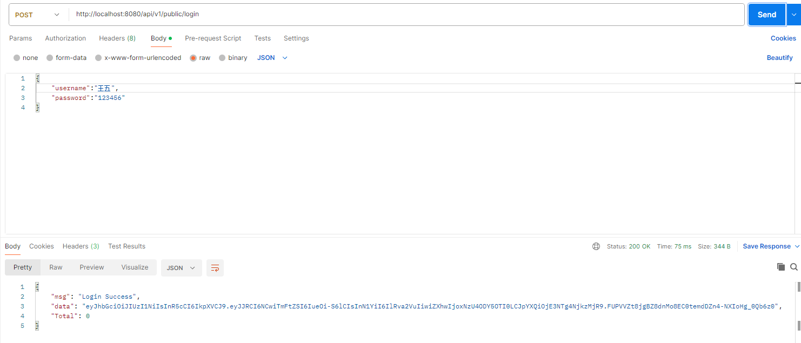
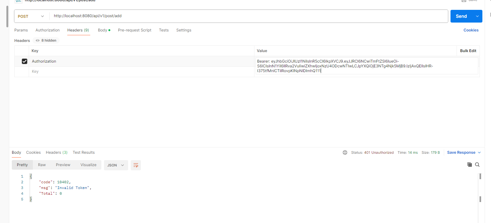

# **个人博客系统——后端项目**


## 运行环境

- go version go1.25.0
- gin，gorm框架
- mysql数据库


## 启动方式

在项目根目录下，运行main.go文件

go run main.go


## 后端接口实现功能

### 用户注册

用户注册不需要鉴权，password采用密文方式存储


### 用户登录

用户登录，成功后返回jwt token



密码验证失败


### 文章创建

需要验证token


token验证



没有传递token，返回code值不同


### 文章读取

文章列表，此接口不要验证，有分页处理


```
{
    "data": [
        {
            "ID": 4,
            "CreatedAt": "2025-09-24T21:38:33.203+08:00",
            "UpdatedAt": "2025-09-24T21:38:33.203+08:00",
            "DeletedAt": null,
            "title": "水浒传",
            "content": "这是中国古典四大名著",
            "userId": 1,
            "User": {
                "ID": 0,
                "CreatedAt": "0001-01-01T00:00:00Z",
                "UpdatedAt": "0001-01-01T00:00:00Z",
                "DeletedAt": null,
                "username": "",
                "password": "",
                "email": ""
            }
        },
        {
            "ID": 5,
            "CreatedAt": "2025-09-24T21:40:41.63+08:00",
            "UpdatedAt": "2025-09-24T21:40:41.63+08:00",
            "DeletedAt": null,
            "title": "水浒传",
            "content": "这是中国古典四大名著",
            "userId": 1,
            "User": {
                "ID": 0,
                "CreatedAt": "0001-01-01T00:00:00Z",
                "UpdatedAt": "0001-01-01T00:00:00Z",
                "DeletedAt": null,
                "username": "",
                "password": "",
                "email": ""
            }
        },
        {
            "ID": 6,
            "CreatedAt": "2025-09-24T21:42:49.27+08:00",
            "UpdatedAt": "2025-09-26T11:54:52.637+08:00",
            "DeletedAt": null,
            "title": "三国演义111",
            "content": "这是中国古典四大名著111",
            "userId": 3,
            "User": {
                "ID": 0,
                "CreatedAt": "0001-01-01T00:00:00Z",
                "UpdatedAt": "0001-01-01T00:00:00Z",
                "DeletedAt": null,
                "username": "",
                "password": "",
                "email": ""
            }
        }
    ],
    "Total": 4
}
```

文章详情


### 文章修改

仅创建人可进行修改，其他人无权限


### 文章删除


